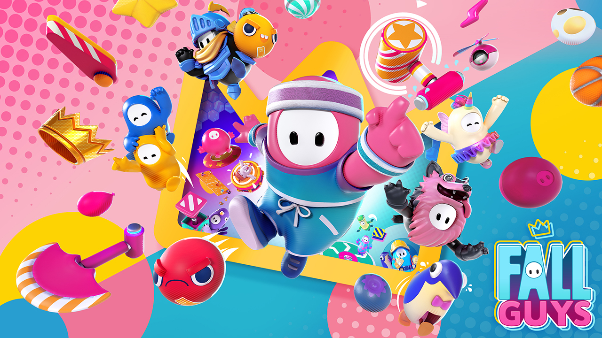

# 🎮 어소트락 아카데미 언리얼 5 프로젝트

## 👥 팀 소개 - 폴가이즈 팀

| 분야       | 담당자         |
|------------|----------------|
| 엔진       | 이현정         |
| 레벨       | 최예나, 이민하 |
| UI         | 이재영         |
| 캐릭터     | 김창수         |

---

## 🛠 프로젝트 개요

에픽 게임즈의 **폴가이즈(Fall Guys)** 를 모작하여 주요 기능을 구현한 언리얼 5 기반 프로젝트입니다.

### ✅ 구현 기능 상세

#### 🔗 멀티 플레이
- 호스트가 **Listen 서버**를 열고, 접속자는 **호스트의 IP와 Port를 입력**하여 멀티 플레이에 참여합니다.
- 최대 20명의 플레이어가 동시에 접속 가능하도록 설계되었습니다.

#### 🧑‍🎨 닉네임 및 코스튬
- 플레이어는 **원하는 닉네임을 설정**할 수 있으며, 게임 도중 닉네임은 **변경이 불가능**합니다.
- 코스튬은 홈 화면의 **코스튬 탭**에서 변경할 수 있으며, **다양한 커스터마이징**을 통해 개성을 표현할 수 있습니다.

#### 🥇 개인전 및 팀전
- 개인전에는 **레이싱 게임**, **생존 게임**이 포함되어 있으며,
- 팀전에는 **점수를 획득하여 승리하는 게임**이 준비되어 있습니다.
- 모든 모드는 **싱글 플레이 테스트**가 가능하도록 설계되어 있습니다.

---

> 본 프로젝트는 언리얼 엔진 5를 기반으로 진행되었으며, 교육 및 포트폴리오 목적으로 제작되었습니다.
